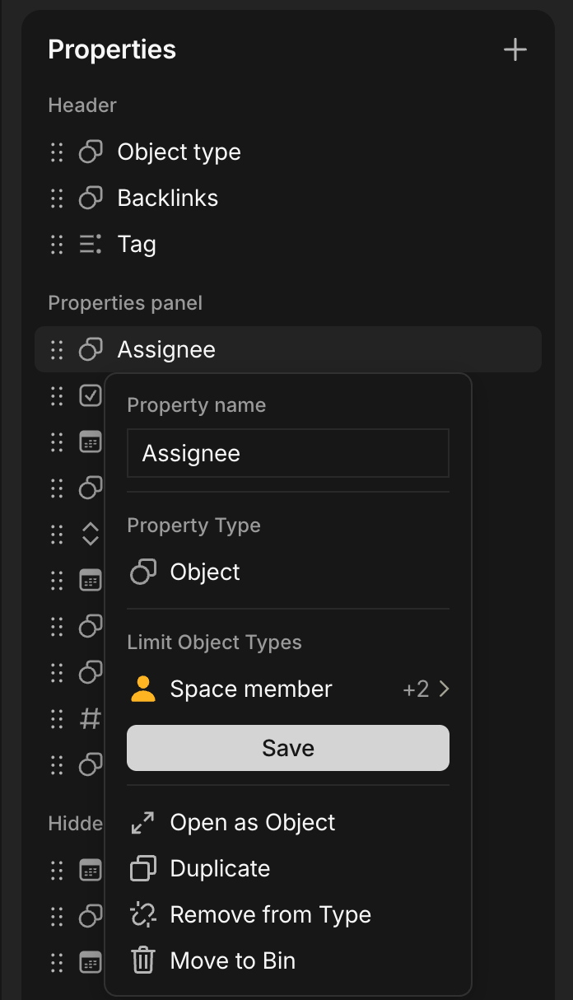

# Anytype Notify
Change language: [Russian](./README-ru.md)

Notifications for new Anytype objects in the workspace via Matrix
<details>
    <summary>Table of Contents</summary>

* [Dependencies](#Dependencies)
* [First Steps](#First-Steps)
    * [Configuring Anytype](#Configuring-Anytype)
    * [Configuring Matrix](#Configuring-Matrix)
    * [Installation](#Installation)
    * [Service Configuration](#Service-Configuration)
    * [Running](#Running)
* [Contributing](#Contributing)
* [License](#License)
</details>

## Dependencies
- Anytype version not earlier than v0.46.6
- Docker and docker-compose
- Account in [matrix.org](https://matrix.org) (or self-hosted matrix)
- [Socat](https://github.com/3ndG4me/socat)
- Systemd (or write your own realisation of [socat.sh](./scripts/socat.sh) for socat autostart on boot)

## First Steps
### Configuring Anytype
To run the notification service you need a server (or other device) with a continuously running Anytype application. At the moment Anytype (v0.47.6) can't work without a graphical environment, so you must install a GUI on the server. Choose a lightweight one (MATE, XFCE, or the other).

Install [Anytype](https://anytype.io) client. I recommend to do this via AppImage:
```sh
curl -L -o Anytype.AppImage "https://download.anytype.io/Anytype-x86_64.AppImage"
chmod +x Anytype.AppImage
```
After installation Anytype may work incorrectly without the following packages: `gnome-keyring libsecret-1-dev`.

After that you need to:
- Create a dedicated account for this service in your Anytype space (for example, name it Notifier) with the Viewer role. 
- Add Anytype to autostart and enable automatic login at system start (otherwise the Anytype API may not start automatically after boot). 
- If you use a self-hosted space, don't forget to choose the correct Anytype mode and provide your configuration file for [Self-hosted](https://doc.anytype.io/anytype-docs/advanced/data-and-security/self-hosting/self-hosted).

You’ll also need to create the following object types in your Anytype space:
- "Task"
    - Objects containing the task name and description.
    - The type must have the following fields:
        - "Notify" with type Checkbox (when set to true the service will send a notification)
        - "Proposed by" with type Object and Limit Object Types set to "Space member".
        - "Assignee" with type Object and Limit Object Types set to "Space member".
            
            Example: 

            
        - Due date with type Date
- "Matrix Member"
    - Objects for mapping a Space member, specified in the fields "Proposed by" and "Assignee", with Matrix ID of that user.
    - The type must have the following fields:
        - "Anytype ID" with type Object and Limit Object Types set to "Space member".
        - "Matrix ID" with type Text (in the format @username:matrix.org or @username:your-server.domain)
    - To correctly display, it is recommended to create such mappings for each user in your Anytype space, who has a Matrix account
- You may create any other object types with the "Notify" field of type Checkbox and they will also be sent notifications, but a part of the notification text may be displayed incorrectly

### Configuring Matrix
- Create a bot account on your Matrix server (or on [matrix.org](https://matrix.org)). The bot is just a regular Matrix account.

- Add the bot to the room where you want to receive notifications.

### Installation
After completing the steps above, install the service:
```sh
git clone git@github.com:aragami3070/anytype-notify.git
cd anytype-notify
```

### Service Configuration
- Create .env file in the root of the project:
```sh
cp .env.example .env
```
- Fill in .env file with your actual data:
    - ANYTYPE_URL - URL of your Anytype space
        - If this service is located on the same server as the Anytype client, then `anytype_ip` will be `localhost`
        - You can find the `space_id` in Anytype app: Space Settings -> General -> More -> Space information -> Space ID
    - ANYTYPE_TOKEN - API key for Anytype API
        - Create it in Anytype app: Notifier's Account Settings -> API Keys -> Create new
    - MATRIX_SERVER - Matrix server where the bot account is registered
    - MATRIX_USER - bot's account username
    - MATRIX_PASSWORD - bot's account password
    - MATRIX_ROOM_ID - ID of the room where the bot was added and will send notifications
        - You can find it in Matrix client: Room Settings -> Advanced -> Internal room ID

- Optionally edit configuration in [config.toml](./config.toml):
    - How often to check for new objects in Anytype (in minutes)
    - Which object type is used for mapping Anytype ID to Matrix ID (if it is different from "Matrix Member")
    - How often to send a reminder for unassigned task (in days)

### Running
Start the socat service to proxy the Anytype API port so the container can access it:
```sh
chmod +x scripts/socat.sh
sudo ./scripts/socat.sh
```
- Raise the container from docker-compose.yaml
```sh
sudo docker-compose up --no-start 
```
- Start the container
```sh
sudo docker start anytype-notifier
```


## Contributing

Read [CONTRIBUTING.md](CONTRIBUTING.md).

## License

[License](License)
